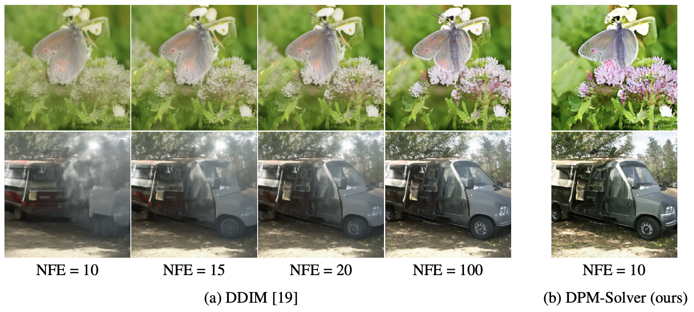

<div align=center>
  <h1>
  DPM-Solver
  </h1>
  <p>
    <a href=https://mhsung.github.io/kaist-cs492d-fall-2024/ target="_blank"><b>KAIST CS492(D): Diffusion Models and Their Applications (Fall 2024)</b></a><br>
    Programming Assignment 6
  </p>
</div> 

<div align=center>
  <p>
    Instructor: <a href=https://mhsung.github.io target="_blank"><b>Minhyuk Sung</b></a> (mhsung [at] kaist.ac.kr)<br>
    TA: <a href=https://63days.github.io target="_blank"><b>Juil Koo</b></a>  (63days [at] kaist.ac.kr)<br>
  </p>
</div>

<div align=center>
   
</div>


## Abstract
DPM-Solver is a novel ordinary differential equation (ODE) solver that enhances the accuracy of solving ODEs for diffusion models in just a few steps. The core concept is to reveal that the ODE of diffusion models can be decomposed into a linear part and a non-linear (exponential) part. Given this insight, we can use a Taylor expansion to approximate the non-linear term. The higher order of the expansion, the more accurate the approximation. Interestingly, the authors also demonstrate that the first-order DPM-Solver is mathematically equivalent to DDIM. In this assignment, we will implement both a first-order and a secod-order DPM-Solver.

## Setup

Install the required package within the `requirements.txt`
```
pip install -r requirements.txt
```


## Code Structure

```
.
├── 2d_plot_dpm_todo    
│   ├── dpm_tutorial.ipynb        <--- Main code
│   ├── dataset.py                <--- Define dataset (Swiss-roll, moon, gaussians, etc.)
│   ├── network.py                <--- A noise prediction network
│   ├── scheduler.py              <--- (TODO) Implement DPM-Solver scheduler
│   └── model.py                  <--- Diffusion model wrapper
│
└── image_dpm_todo      
    ├── dataset.py                <--- Ready-to-use AFHQ dataset code
    ├── model.py                  <--- (TODO) Diffusion model wrapper. Finish implementing CFG sampling.
    ├── scheduler.py              <--- (TODO) Finish implementing CFG sampling.
    ├── module.py                 <--- Basic modules of a flow prediction network
    ├── network.py                <--- U-Net
    └── sampling.py               <--- Image sampling code
     
```

## Task 0: Introduction
### Assignment Tips
In this assignment, we explore a high-order solver of the ODEs for diffusion models. The more accurate the solver is, the faster the sampling can be done with fewer steps. Let's say the forward pass of diffusion models is represented as follows:

$$
\begin{align*}
q(x_t | x_0) = \mathcal{N}(x_t | \alpha(t) x_0, \sigma^2(t) I).
\end{align*}
$$

The forward pass can be expressed its corresponding SDE form:

$$
\begin{align*}
dx_t = f(t) x_t dt + g(t) dw_t, \\
\text{where } f(t) = \frac{d \log \alpha_t}{dt} \text{ and } g^2(t) = \frac{d\sigma_t^2}{dt} - 2 \frac{d \log \alpha_t}{dt}\sigma_t^2.
\end{align*}
$$

According to [Song et al. [ICLR'21]](https://arxiv.org/abs/2011.13456), we can also compute the ODE form of the _reverse_ process:

$$
\begin{align*}
dx_t = [f(t) x_t + \frac{g^2(t)}{2 \sigma_t} \epsilon_\theta(x_t, t) ] dt,
\end{align*}
$$

which is called Probability Flow ODE (PF-ODE). Note that this ODE equation is a first-order linear non-homogeneous equation, for which exact solution can be computed:

$$
\begin{align*}
x_t = e^{\int_s^t f(\tau) d\tau} x_s + \int_s^t ( e^{\int_\tau^t f(r) dr} \frac{g^2(\tau)}{2 \sigma_\tau} \epsilon_\theta(x_\tau, \tau) ) d\tau,
\end{align*}
$$

where the first term on the right side is a linear term, and the second term, which involves an integral over noise predictions, is a non-linear term. 

To simplify the ODE solution equaiton, we introduce a new notation, $\lambda_t := \log (\alpha_t / \sigma_t)$, and use "change-of-variable" for $\lambda$. Then, we have:

$$
\begin{align*}
x_t = \frac{\alpha_t}{\alpha_s} x_s - \alpha_t \int\_{\lambda_s}^{\lambda_t} e^{-\lambda} \hat{\epsilon}\_\theta (\hat{x}_\lambda, \lambda) d\lambda,
\end{align*}
$$

where $\hat{x}\_\lambda := x\_{t(\lambda)}$ and $\hat{\epsilon}\_\theta (\hat{x}_\lambda, \lambda):= \epsilon\_\theta (x\_{t(\lambda)}, t(\lambda))$.

Now the simplified solution reveals the integral is represented as the _exponentially weighted integral_ of $\hat{\epsilon}_\theta$, which is closely related to the _exponential integrators_ commonly discussed in the literature of ODE solvers. 

We can apply a Taylor expansion into the solution:

$$
\begin{align*}
\hat{\epsilon}\_\theta (\hat{x}\_\lambda, \lambda) = \sum_{n=0}^{k-1} \frac{(\lambda - \lambda\_{s})^n}{n!} \hat{\epsilon}_\theta^{(n)} (\hat{x}\_{\lambda\_s}, \lambda_s) + \mathcal{O}((\lambda - \lambda_s)^k),
\end{align*}
$$

where $\hat{\epsilon}\_\theta^{(n)}$ is the $n$-th order derivative of $\hat{\epsilon}_\theta$.

As a result, we can obtain an approximation for $x_s \rightarrow x_t$ with the $k$-order approximation. For instance, as $k=1$, which is called DPM-Solver-1, the solution is:

$$
\begin{align*}
x_t = \frac{\alpha_t}{\alpha_s} x_s - \sigma_t (e^{h}-1) \epsilon_\theta (x_s, s), \text{ where } h = \lambda_t - \lambda_s.
\end{align*}
$$

For $k \leq 2$, Taylor expansion needs additional intermediate points between $t$ and $s$. Below is an algorithm when $k=2$, called DPM-Solver-2.

<p align="center">
  
</p>

## Task 1: Implementing DPM-Solver-1 

❗️❗️❗️ **You are only allowed to edit the part marked by TODO.** ❗️❗️❗️

#### 1-1: Implement the forward pass of DPM-Solver.
Copy and paste your `2d_plot_diffusion_todo/network.py` from Assignment 2 into the `2d_plot_dpm_todo` directory.
Implement `add_noise()` function in `2d_plot_dpm_todo/scheduler.py` based on Equation 2.1 in the DPM-Solver paper.
You can use `dpm_alphas`, `dpm_sigmas` and `dpm_lambdas` variables if needed.

#### 1-2: Implement one step denoising of DPM-Solver-1
Implement `first_order_step()` funciton in `2d_plot_dpm_todo/scheduler.py`. 

#### 1-3: Test DPM-Solver-1 on a Swiss-Roll distribution
Once you finish implementing DPM-Solver-1, run `2d_plot_dpm_todo/dpm_tutorial.ipynb` to test DPM-Solver-1 on a Swiss-Roll distribution.

Take screenshots of:

1. the training loss curve
2. the Chamfer Distance reported after executing the Jupyter Notebook
3. the visualization of the sampled particles.

#### 1-4: Conditional Image Generation with DPM-Solver-1
We will now sample images using DPM-Solver-1 with the same CFG model trained in Assignment 2. Copy and paste your `model.py` implementation from Assignment 2 into the `image_dpm_todo` directory, and complete the TODOs in `image_dpm_todo/scheduler.py`. As in Assignment 2, sample images using the following command:

```
python sampling.py --ckpt_path ${CKPT_PATH} --save_dir ${SAVE_DIR_PATH}
```

Measure FID score:

```
python dataset.py
python fid/measure_fid.py $GT_IMG_DIR $GEN_IMG_DIR
```

Use the evaluation set of the AFHQ dataset, `data/afhq/eval`, not `data/afhq/val` for $GT_IMG_DIR.

Take a screenshot of a FID and include at least 8 sampled images.


## Task 2: Implementing DPM-Solver-2

#### 2-1: Implement DPM-Solver-2 (Optional Task)
Implement `second_order_step()` function in `2d_plot_dpm_todo/scheduler.py`. Since the $k\leq 2$ order DPM-Solver requires additoinal model predictions at intermediate timestep in each denoising step, you might need to call the network's forward function inside the scheduler. For this, you can refer to the example of `self.net_forward_fn()` in the code. 

Note that you need to run sampling with 50 inference steps. The number of timesteps is divided by the order to ensure that the total number of function evaluations (NFE) is the same regardless of the order.

#### 2-2: Test DPM-Solver-2 on a Swiss-Roll distribution
Repeat the same process done in Task 1-3 but with DPM-Solver-2.

#### 2-3: Conditional Image Generation with DPM-Solver-2
Repeat the same process done in Task 1-4 but with DPM-Solver-2.

## What to Submit

<details>
<summary><b>Submission Item List</b></summary>
</br>

- [ ] Code without model checkpoints
      
**Task 1**
- [ ] Loss curve screenshot
- [ ] Chamfer distance result of DPM-Solver-1
- [ ] Visualization of DPM-Solver-1 samples
- [ ] FID score results obtained with CFG scale of 7.5 and DPM-Solver-1
- [ ] At least 8 generated images with DPM-Solver-1


**Task 2 (Optional)**
Repeat the above steps using DPM-Solver-2 instead of DPM-Solver-1.


</details>

In a single PDF file, write your name and student ID, and include submission items listed above. Refer to more detailed instructions written in each task section about what to submit.
Name the document `{NAME}_{STUDENT_ID}.pdf` and submit **both your code and the document** as a **ZIP** file named `{NAME}_{STUDENT_ID}.zip`. 
Exclude any model checkpoints and the provided pre-trained classifier checkpoint when compressing the files.
Submit the zip file on GradeScope.

## Grading
**You will receive a zero score if:**
- **you do not submit,**
- **your code is not executable in the Python environment we provided, or**
- **you modify anycode outside of the section marked with `TODO` or use different hyperparameters that are supposed to be fixed as given.**

**Plagiarism in any form will also result in a zero score and will be reported to the university.**

**Your score will incur a 10% deduction for each missing item in the submission item list.**

Otherwise, you will receive up to 20 points from this assignment that count toward your final grade.

- Task 1
  - 10 points: Achieve CD lower than 40 on the Swiss-Roll distribution, and achieve FID less than 30 on image generation with CFG with a scale of 7.5.
  - 5 points: Either achieve CD between 40 and 60, or achieve FID between 30 and 50.
  - 0 point: otherwise.
- Task 2
  - Same criteria as Task 1, but using DPM-Solver-2.

## Further Readings

If you are interested in this topic, we encourage you to check ou the materials below.

- [DPM-Solver: A Fast ODE Solver for Diffusion Probabilistic Model Sampling in Around 10 Steps](https://arxiv.org/abs/2206.00927)
- [DPM-Solver++: Fast Solver for Guided Sampling of Diffusion Probabilistic Models](https://arxiv.org/abs/2211.01095)
- [Score-Based Generative Modeling through Stochastic Differential Equations](https://arxiv.org/abs/2011.13456)
- [Elucidating the Design Space of Diffusion-Based Generative Models](https://arxiv.org/abs/2206.00364)
